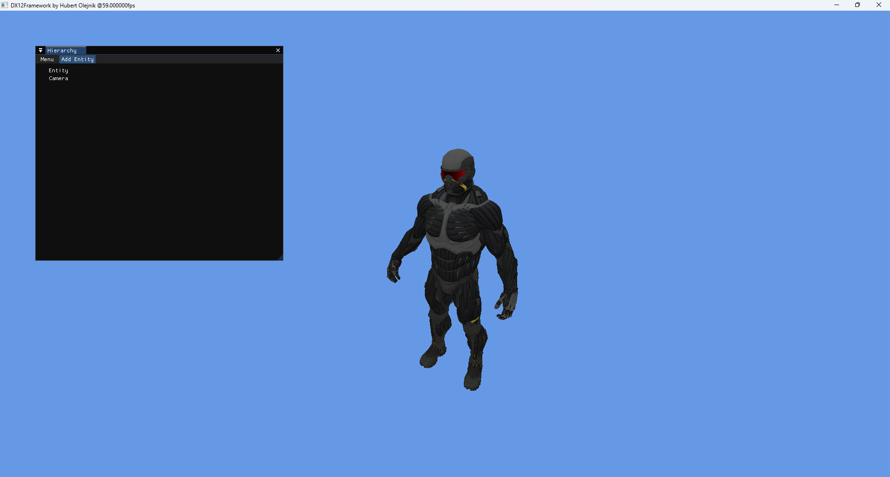
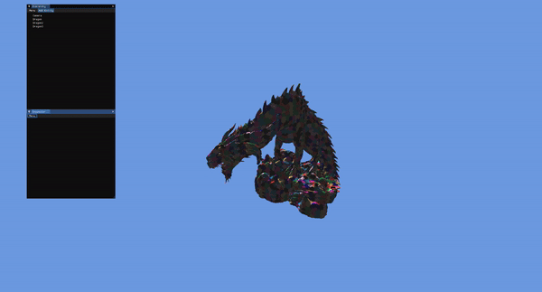

# DirectX 12 graphics prototyping framework
## 23.07.2024

  

## 5.10.2024

  

## 13.10.2024

  

Work very much in progress.

Milestones:

- [X] Rendering a cube
- [x] Model loading
- [x] Mesh shading
- [ ] Postprocessing framework
- [ ] PBR and IBL
